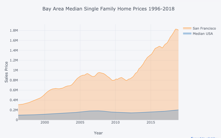
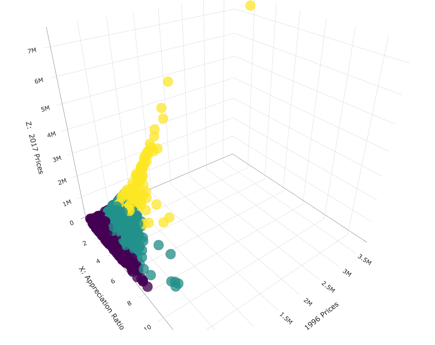
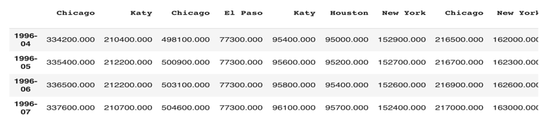
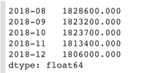
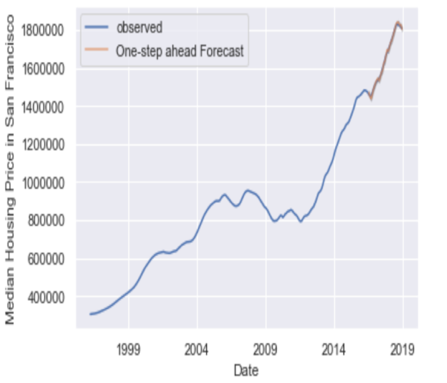
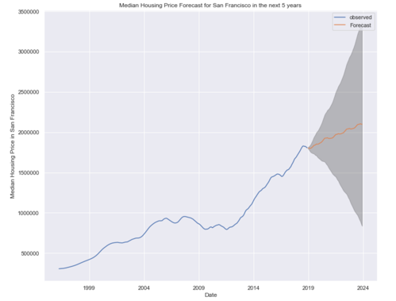
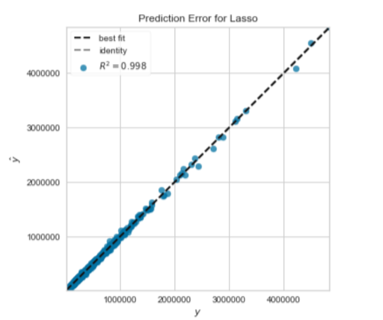

# zillow_housing_price_prediction

Wine Quality Analysis
By: William Gao
Kernel Access: https://colab.research.google.com/drive/1YcUzzvo8pdXnviwQdGnKhQyePamN6Msk 

# Overview
So far, we have learned basic machine learning pipelines including data ingestion, EDA, Modeling, and model evaluation. In model building, we have been working with traditional method such as linear regression, random forest, etc. This project is to explore time series modeling and traditional regression modeling using U.S housing price from Zillow, one of the largest real estate listing sites. The housing data from Zillow is considered to be complete and it can represent U.S. housing market very well. The goal of this project is to compare the suitability of traditional regression models such as Lasso regression verses ARIMA time series model. 

# Techniques and Procedure
1.	The data is ingested to the Colab notebook and EDA is performed by the instructor. Therefore, I have an overall understanding of how the housing market performs in the past two decades. The overall trend of median price in most of the major cities are trending up while median housing price in the U.S. are stable over the years.
   
2.	Since the data is well illustrated in sequence with time label. The ARIMA is used to fit the model.
3.	First of all, I transposed the table into data frame as such: 
  
4.	Then San Francisco housing data is extracted from the above data frame and convert index into datetime format. 
  
5.	Before fitting data into the ARIMA model, the autocorrelation is accessed to ensure the auto correlation diminished over time.After that, the optimum parameter is tested and determined for the ARIMA. The result is preferable. The 60 months of outcomes are predicted:
 
6.	Besides of ARIMA, Lasso regression is performed to represent models from traditional modeling methods. The data fed into the Lasso regression is the shape of original data where indexes are cities and columns are dates. As shown on the right, one month of housing price is predicted and the result is preferable with R^2 of 0.998
  

# Conclusion 
	
This is the first time I explore and compare the two ways of predicting time series data. Here is what I recommend: 
1.	The time series data can be better represented and predicted by time series models such as ARIMA but it can only apply to one subject (city).
2.	Traditional models like Lasso regression can also make predictions on time series but it requires multiple time series from multiple sources (cities) and it require manual adjustment for deviations for the future prediction. The result of prediction in one subject (city) will be influenced by inputs from other subjects (cities)

Therefore, Time series model in my opinion is more suitable for prediction single target and traditional modeling such as Lasso regression can be used to factor in all factors that can contribute to the outcome.
